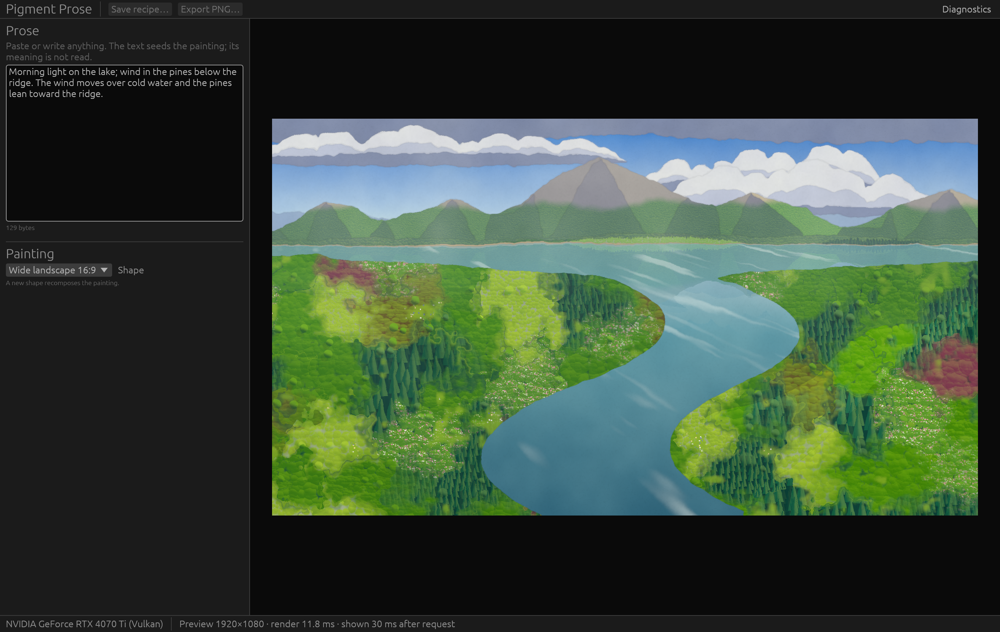

# The desktop studio (task 11)

`pigment-studio` (`crates/pigment-studio`) is the desktop app: an eframe/egui 0.36 window around the approved painting renderer ([ADR 0001](decisions/0001-renderer-and-desktop-shell.md)). Task 11 delivered the shell and the preview lifecycle. The artistic controls, variations and recipe open/save arrive in task 12, and the export dialog in task 13. The visual design pass is scheduled for task 12, once every control exists (user decision, 2026-09-27). Evidence: [evidence/studio-11](evidence/studio-11/README.md).



```sh
cargo run --release -p pigment-studio                      # the app
cargo run --release -p pigment-studio -- --help            # options
cargo run --release -p pigment-studio -- --script --preview-delay-ms 1500 --screenshot w.png
```

## Layout

- **Top bar:** app name, **Save recipe…** and **Export PNG…** (reserved: visible and disabled, with a hover note), and **Diagnostics** (Ctrl+D).
- **Left panel (resizable):** the multiline **Prose** editor with a byte count, then the compact **Painting** controls. Today that is **Shape** (16:9, 3:2, 1:1, 4:5, 9:16), noted as "recomposes the painting".
- **Centre:** the painting at the document's aspect ratio, centred on a dark ground. Once settled it is drawn at 1:1 physical pixels. While a new size is on its way, the old image is scaled to fit, never stretched to the window's shape. Before the first preview a spinner shows.
- **Status line:** the GPU in use (with **SOFTWARE RENDERER, not GPU accelerated** if one was allowed), the preview size, render time and request-to-shown time, and a spinner with "Painting…" while a newer preview is on its way.
- **Diagnostics window:** adapter, backend, device type, whether it is hardware, the driver, the wgpu version, key limits, job counters (started, painted, cancelled, failed, in flight), scenes built and reused, stale results dropped, and any simulated delay.
- **Default scene:** a synthetic default passage, so the first launch shows a painting. Edits apply live: there is no Generate button. When the prose is empty or blank, a warning says so and the preview keeps the last painting, so the draft and the rendered recipe can never be confused.

## Preview lifecycle

| Rule | Implementation |
| --- | --- |
| The UI thread never waits on the GPU | One render thread (`worker::PreviewWorker`) owns `PaintRenderer` and loops on `job::Mailbox`. The UI submits snapshots (`PreviewJob`) and drains results without blocking. The only wait is shutdown, bounded at 2 s |
| Bounded queue | `Mailbox`: one pending slot. A new job replaces the pending one and cancels the running one. The result channel holds 2, so a UI that stops collecting (hidden window) blocks the worker instead of growing memory |
| Monotonic ids, stale results dropped | `RequestIds`; `preview::PreviewView` shows a result only if it is newer than what is on screen (`PreviewState::accept`). An old failure cannot replace a newer image |
| Debounce | prose: 300 ms after the last keystroke; preview-area resize: 100 ms; shape change and first frame: immediately (`preview::Scheduler`) |
| Size | the largest rectangle of the document's aspect ratio inside the preview area, in physical pixels, capped at a 1920 px long edge (`preview::preview_size`) |
| Stable scene data | the worker reuses the last `Scene` while seeds, form and aspect ratio are unchanged, so resizes and paint-only changes never rebuild it. `PaintRenderer` also keeps that scene's GPU buffers |
| One device | `GpuContext` (the capability service) opens the device, and egui shares it through `WgpuSetup::Existing` |
| Shutdown | closing the window closes the mailbox, cancels the running job, interrupts a simulated delay and joins the worker |

## GPU initialization and failures

- **Capability service:** `GpuContext::new(&AdapterPolicy)` uses portable WebGPU limits, ranks discrete over integrated, and refuses software rasterizers unless `--allow-software` is given (then labelled everywhere).
- **Initialization failure** (no adapter, only software, no match for `--adapter`, device refused): the error is printed, and a window titled "Pigment Prose needs a hardware GPU" shows the reason with driver hints plus every adapter found, with Copy details and Quit. It exits with status 1. That window is drawn with whatever wgpu can create, and it never claims acceleration.
- **Device lost:** the preview stops and says "The GPU was reset (device lost)… Restart Pigment Prose to continue. Your prose is still in the editor." No more jobs are submitted. The window and the painter share one device, so recovering in place would mean recreating egui's renderer too. The ADR allows a restart message, and task 12's Save will let the user keep the recipe first. Tested with `--lose-device-after N`, which simulates the loss in the worker. A real driver reset has not been exercised.
- **Adapter that cannot present** (known limitation, [follow-up task](#known-limits)): on this machine, `--adapter intel` picks the Intel iGPU, which can paint but is not connected to the display, and egui-wgpu cannot create a surface on it. The app now explains this and exits with status 2 instead of a bare panic.

## Accessibility, keyboard and scaling

- egui's AccessKit integration is on (`eframe` feature `accesskit`). With accessibility enabled, the tree exposed on AT-SPI ([dump](evidence/studio-11/atspi-tree-linux-2026-09-27.txt), via [`scripts/atspi-dump.py`](../scripts/atspi-dump.py)) has named buttons, the Diagnostics toggle button, an entry named **Prose**, a combo box named **Shape**, status labels, and an image named **Painting preview**. One focusable node without a name remains; it is probably the side panel's resize handle.
- **Keyboard:** egui's default Tab and Shift+Tab focus order with focus rings: Diagnostics, the prose editor, Shape (Save and Export are disabled). The app adds Ctrl+Q to quit and Ctrl+D to toggle diagnostics. Ctrl+Plus, Ctrl+Minus and Ctrl+0 zoom (egui default). None of this is exercised by the scripted check yet; it was not driven by keyboard in this task.
- **High DPI:** the UI follows the display's scale factor, and the capture above is at 2×. The preview is rendered at physical pixels, so it stays sharp.
- **Not verified:** a real screen reader session (Orca, Narrator, VoiceOver), and whether a live screen reader announces the "Painting…" status. Task 14 or the design pass should check both.

## Measured (Linux, RTX 4070 Ti, Vulkan, driver 615.71.09, KDE Plasma Wayland at 2×)

| Scenario | Result |
| --- | --- |
| Preview, 1848×1039 to 1920×1080: render + readback | 4.4–11.8 ms |
| Preview request → result collected by the UI thread (scene generation, render, readback, hand-off; the texture upload and draw follow in that frame) | 21.6 ms and 29.6 ms (n=2; settled-preview target ≤ 150 ms) |
| With a simulated 1.5 s render: longest gap between UI frames while typing, resizing and closing | 20.8 ms (310 frames while a job was in flight) |
| Close while a delayed render runs → worker stopped | 4.2 ms |
| 1000 previews requested in 0.56 s (sizes changing, paint changes, a new prose every 50) | ≤ 1 running + 1 pending at every step, newest shown at the end, 563 jobs started of 1000, scenes reused 539× and built 24×, resident memory +2.4 to +4.6 MiB after warm-up (two runs) (`gpu_preview.rs`) |
| Whole-process GPU memory while running (nvidia-smi) | 262 MiB peak |

These are measurements of this machine, not targets met in general. Interaction previews at 960 px during slider drags arrive with the sliders in task 12.

## Tests

| Test | Where | Covers |
| --- | --- | --- |
| `pigment-studio --script` | the real window | Types 68 characters at 60 ms each and resizes the window twice. It then waits for the newest request to be shown, feeds the view a deliberately out-of-order old result (it must be rejected), captures the window, and closes while a render is in flight. With `--preview-delay-ms` it also requires UI frame gaps < 250 ms during delayed renders. With `--lose-device-after` it requires the device-loss state. Exit status 0 only if every check passes |
| `a_request_storm_stays_bounded_and_ends_on_the_newest` | `crates/pigment-studio/tests/gpu_preview.rs` (hardware) | Real `PaintRenderer`: bounded work, newest shown, scene reuse, memory growth < 64 MiB |
| `worker::tests::*` | portable | Scene reuse, a 200-request burst against a slow renderer (submit never waits, ≤ 5 jobs start, newest delivered), prompt shutdown during a 30 s render, shutdown with undrained results, simulated device loss, scene errors as failures, UI wake-up |
| `preview::tests::*` | portable | Preview sizing (aspect, cap, too small), debounce, out-of-order and failed results, device loss ending the pending state |

## Known limits

- One device for the window and the painter: an adapter that cannot present to the window is refused (see above). Tracked as a follow-up task: "studio on multi-GPU systems (paint adapter vs display adapter)".
- Device loss needs a restart.
- Windows (Direct3D 12) and macOS (Metal): **not run**. Portable CI builds and unit-tests the crate there, but no window has been opened (tasks 21–22).
