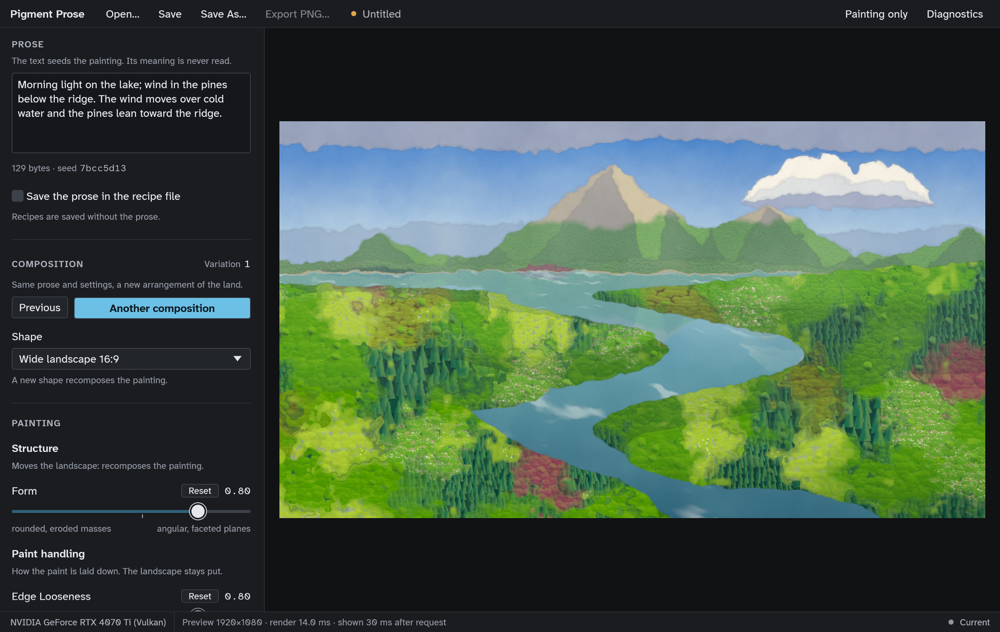

# The desktop studio (tasks 11–13)

`pigment-studio` (`crates/pigment-studio`) is the desktop app: an eframe/egui 0.36 window around the approved painting renderer ([ADR 0001](decisions/0001-renderer-and-desktop-shell.md)). Task 11 delivered the shell and the preview lifecycle. Task 12 added the artistic controls, compositions, recipe open/save and the visual design (product context: [PRODUCT.md](../PRODUCT.md); visual system: [DESIGN.md](../DESIGN.md)). Task 13 added export. Evidence: [evidence/studio-11](evidence/studio-11/README.md), [evidence/studio-12](evidence/studio-12/README.md), [evidence/studio-13](evidence/studio-13/README.md).



```sh
cargo run --release -p pigment-studio                      # the app
cargo run --release -p pigment-studio -- --help            # options
cargo run --release -p pigment-studio -- --script --preview-delay-ms 1500 --screenshot w.png
```

## Layout

- **Top bar:** the wordmark; **Open…**, **Save**, **Save As…** and **Export PNG…**; the document name (Untitled or the file name), with an amber dot while there are unsaved changes; then **Painting only** and **Diagnostics** on the right. The window title follows the document ("*name — Pigment Prose").
- **Export bar** (only while an export runs): the file, its pixel size, the stage ("Tile 5 of 12", "Writing the file") on a bar that counts tiles, and **Cancel export**.
- **Notice bar** (only when there is something to say): the result of the last file operation or export. "Done" confirmations clear after 6 s; notes (a recipe from an older generator or renderer) and problems stay until dismissed. Messages name the file, never its contents.
- **Control column (resizable, 300–600 pt, scrolls):**
  - **Prose:** the editor, the byte count and the seed code (the first 8 hex digits of the text's digest: what the painting is made from), and the explicit **Save the prose in the recipe file** checkbox, with a note saying which way it is set.
  - **Composition:** the variation number, **Previous**, **Another composition** (the primary action) and **Shape** (16:9, 3:2, 1:1, 4:5, 9:16, or "Custom W:H" for a recipe with another ratio). A new shape keeps the document's size class and recomposes the painting.
  - **Painting:** the controls in three groups (Structure, Paint handling, Appearance), each with a note on whether it moves the landscape. Then **Advanced** (collapsed) and **Reset all painting controls**.
- **Painting area:** the painting at the document's aspect ratio on a neutral surround. When the image on screen is not the current recipe, a chip at its top-left says so ("Showing earlier settings · painting the latest", or why the latest could not be painted).
- **Status line:** the GPU in use (**SOFTWARE RENDERER, not GPU accelerated** if one was allowed), the preview size and timings, and a state word: Current, Painting…, Earlier settings, Preview failed or GPU reset.
- **Diagnostics window:** adapter, backend, device type, hardware or not, driver, wgpu version, key limits, job counters, scenes built and reused, stale results dropped, and any simulated delay.
- **Painting only** (Ctrl+\\) folds the control column away so the painting takes the window.

## Controls

Generated from `settings::CONTROLS` (`crates/pigment-studio/src/controls.rs`). Ranges, defaults and the meanings of the two ends come from the [control table](architecture.md#controls-and-invalidation); the UI clamps by construction and the document validates.

| Group | Main | Advanced |
| --- | --- | --- |
| Structure (recomposes) | Form | Relief, Woodland density |
| Paint handling (landscape stays put) | Edge Looseness, Wash / Gouache | Mark scale, Granulation, Paper grain |
| Appearance (landscape stays put) | Atmosphere, Color intensity, Palette | — |

- Each slider row shows its label, the value to two decimals, a notch under the track at the default, and the two ends' meanings. While the value is off its default, a **Reset** button appears. The tooltip names the value, the ends and the recipe key.
- The accessible value text names the value and the nearer end, for example "0.54 (nearer angular, faceted planes)" or "0.55 (default)".
- Form, Edge Looseness and Wash / Gouache are separate controls on separate fields (tested per control, `settings::tests::each_control_edits_only_its_own_field_in_its_channel`). There is no coupled style slider, and no season, biome, history or camera controls.

## Compositions

**Another composition** increments the recipe's variation and keeps the prose seed, every artistic setting and the frame. **Previous** steps back one, down to 0. The variation is stored in the recipe, so reopening a recipe restores its composition. Only the invalidated stages rerun (`Invalidation::between`): a new variation or any Structure control rebuilds the scene, while any other control repaints the existing scene.

## Recipes: open and save

`crates/pigment-studio/src/files.rs`, over task 10's `Document` ([recipe-files.md](recipe-files.md)).

- **Native dialogs** via rfd: the XDG desktop portal on Linux, `IFileDialog` on Windows and `NSOpenPanel`/`NSSavePanel` on macOS. They run on a helper thread, so the window keeps painting while one is open. The save dialog suggests the current file name, or `painting.recipe.json` for an untitled document (never a name taken from the prose). The dialog's own overwrite confirmation is used, following each platform's convention.
- **Save** writes to the current file, and asks for one only the first time. **Save As…** always asks.
- **Unsaved work is never replaced silently.** Opening a recipe or closing the window with unsaved changes asks "Save changes to this painting?": **Save…**, **Cancel**, or **Don't save**, which is kept apart. Cancelling any dialog, or a failed save, stops the whole operation. The untouched launch document asks nothing.
- **A failed open changes nothing** and names the file. **A failed save** keeps the path and the unsaved state, and leaves any existing file as it was.
- **Source-free recipes** (saved without prose) open with an empty editor and a note: the painting is rebuilt from the stored seed, and the words cannot be recovered. No prose is invented. Typing in the editor starts a new painting from that text. Saving again stays source free.
- A recipe from an older generator or renderer opens with a note ("made with renderer v0; this version (v1) may paint differently"). The recorded versions update when it is saved.

## Export

`crates/pigment-studio/src/export.rs` over task 09's `pigment_io::export_png` ([export.md](export.md#from-the-studio-task-13)).

- **Export PNG…** (Ctrl+E) opens a dialog that states what is exported: the painting as it is now, this composition and these settings. It warns when the preview is still painting, because the export uses the newest settings, not the image on screen.
- **Shape** in the dialog changes the document's proportions, and says that this recomposes the painting; it is not a resize.
- **Size:** 4K or 8K presets, shown with their real pixel sizes for this shape (16:9: 3840×2160 and 7680×4320; 4:5: 3072×3840 and 6144×7680; 1:1: 3840×3840 and 7680×7680), or a custom width and height that snap to the painting's exact proportions. The dialog shows the exact output ("Exports 7680 × 4320 px (33.2 megapixels)") and explains that DPI is only a print label. Sizes outside 64–16384 px or 4:1 are explained, and Export… is disabled.
- **Snapshot:** pressing Export… copies the seeds, form, aspect ratio, appearance and size at that moment; then the save dialog asks where. Moving sliders or changing composition afterwards never reaches the export (tested byte for byte on the GPU). The prose is not part of an export job.
- **Destination:** the platform save dialog, suggesting `painting-WxH.png` or the recipe's name (never the prose), with its own overwrite question. Cancelling it exports nothing.
- **One export at a time**, on its own thread with its own renderer on the shared device. Previews keep working, and Export PNG… is disabled while one runs.
- **Progress** is the renderer's own count of tiles, then "Writing the file". There is no percentage of time and no time estimate.
- **Cancel export** stops at the next tile. The partial file is removed and an existing file is kept.
- **Result:** "Exported NAME (W × H px, SIZE) to FOLDER" with **Copy path**. Failures say what to do: a full disk, an unwritable folder, GPU memory, a GPU reset. Any existing file is unchanged.
- **Closing the window during an export** asks: **Keep exporting**, or **Stop export and close** (cancels, removes the partial file, then closes, still asking about unsaved changes). Quitting by other means cancels the export and waits up to 5 s for the cleanup.
- **The PNG holds only the image:** `IHDR`, `sRGB`, `IDAT` and `IEND`. No prose, recipe, path, watermark or attribution, and the recipe is not embedded.

## Keyboard

| Keys | Action |
| --- | --- |
| Tab / Shift+Tab | Move focus. Every control is reachable, and the column scrolls the focused control to its centre |
| Left / Right (or Down / Up) on a slider | −/+ 0.01 |
| Page Down / Page Up on a slider | −/+ 0.1 |
| Home / End on a slider | the low / high end |
| Delete or Backspace on a slider | back to the default |
| Alt+Right / Alt+Left (⌥ on macOS) | Another composition / Previous |
| Ctrl+O, Ctrl+S, Ctrl+Shift+S (⌘ on macOS) | Open, Save, Save As |
| Ctrl+E | Export PNG… |
| Ctrl+\\ | Painting only |
| Ctrl+D | Diagnostics |
| Ctrl+Q | Quit (asks if there are unsaved changes) |
| Enter / Space | Press the focused button. In the unsaved-changes prompt, Save… has focus and Escape cancels |
| Ctrl+Plus / Ctrl+Minus / Ctrl+0 | Zoom the interface (egui default) |

## Preview lifecycle

| Rule | Implementation |
| --- | --- |
| The UI thread never waits on the GPU or a dialog | One render thread (`worker::PreviewWorker`) owns `PaintRenderer` and loops on `job::Mailbox`. The UI submits snapshots (`PreviewJob`) and drains results without blocking. File dialogs run on a helper thread. The only waits are at shutdown: the preview worker (2 s) and a running export's cleanup (5 s) |
| Exports | a separate thread with its own `PaintRenderer` (`export::Exporter`), one job at a time, never superseded by previews |
| Bounded queue | `Mailbox`: one pending slot. A new job replaces the pending one and cancels the running one. The result channel holds 2 |
| Monotonic ids, stale results dropped | `RequestIds`; `preview::PreviewView` shows a result only if it is newer than what is on screen. An old failure cannot replace a newer image |
| Debounce | prose: 300 ms after the last keystroke; preview-area resize: 100 ms; shape, composition, opened recipe and first frame: immediately (`preview::Scheduler`) |
| Sliders | not debounced: each value renders at once as an **interaction preview** (long edge 960 px), and latest-wins coalescing absorbs the rate. 150 ms after the last slider input, the **settled preview** follows |
| Size | the largest rectangle of the document's aspect ratio inside the preview area, in physical pixels, capped at a **3840 px** long edge (raised from 1920 in task 12 so the painting fills the area on high-DPI displays; 3840×2160 renders in 9–15 ms here). Settled images are drawn 1:1; interaction previews are scaled up to that size, never stretched (`preview::display_size`) |
| Stable scene data | the worker reuses the last `Scene` while seeds, form and aspect ratio are unchanged, so resizes and paint-only changes never rebuild it |
| What is on screen | the app remembers which submission each shown image came from, so it can say whether the painting on screen is the current recipe (`StudioApp::preview_is_current`) |
| One device | `GpuContext` opens the device, and egui shares it through `WgpuSetup::Existing` |
| Shutdown | closing the window closes the mailbox, cancels the running job, interrupts a simulated delay and joins the worker |

## GPU initialization and failures

- **Capability service:** `GpuContext::new(&AdapterPolicy)` uses portable WebGPU limits, ranks discrete over integrated, and refuses software rasterizers unless `--allow-software` is given (then labelled everywhere).
- **Initialization failure** (no adapter, only software, no match for `--adapter`, device refused): the error is printed, and a window titled "Pigment Prose needs a hardware GPU" shows the reason with driver hints and every adapter found, with Copy details and Quit. It exits with status 1 and never claims acceleration.
- **Device lost:** the preview stops and says "The GPU was reset (device lost)… Save your recipe, then restart Pigment Prose to continue." Saving still works. No more jobs are submitted. Tested with `--lose-device-after N`; a real driver reset has not been exercised.
- **Adapter that cannot present** (known limitation): on this machine, `--adapter intel` picks the Intel iGPU, which can paint but is not connected to the display. The app explains this and exits with status 2. Tracked as "studio on multi-GPU systems".

## Accessibility and scaling

- AccessKit is on. The AT-SPI tree ([dump](evidence/studio-12/atspi-tree-linux-2026-09-28.txt)) names every button, the two toggle buttons, the prose entry, the checkbox, both combo boxes, every slider (with numeric value and value text), the status word ("Preview: Current") and the image **Painting preview**.
- The type is Atkinson Hyperlegible Next at 15 pt for body text, and text contrast is at least 4.5:1 everywhere (tested). Keyboard focus is a 2 pt ring, drawn in ink on the accent-filled buttons.
- The UI follows the display's scale factor, and the preview is rendered at physical pixels.
- **Not verified:** a real screen-reader session (Orca, Narrator, VoiceOver), including whether "Painting…" is announced (task 14).

## Measured (Linux, RTX 4070 Ti, Vulkan, driver 615.71.09, KDE Plasma Wayland at 2×)

| Scenario | Result |
| --- | --- |
| Request → shown, undelayed, including drags (task 12) | median 10 ms, p95 20 ms |
| Settled preview render + readback | 2.3 ms median at 1920×1080, 8.9 ms at 3840×2160 (`paint-bench`) |
| Longest UI frame gap with a simulated 1.5 s render (task 12 script) | 19.7 ms |
| Paint-only slider drag, one value per frame for 1 s | 0 scenes built |
| 1000 previews in 0.56 s (task 11) | ≤ 1 running + 1 pending, newest shown, memory +2.4 to +4.6 MiB |
| Whole-process GPU memory (nvidia-smi, 1360×860 pt window) | 262 MiB peak. A maximised window on a 4K-class display has not been measured |

Details: [evidence/studio-11](evidence/studio-11/README.md), [evidence/studio-12](evidence/studio-12/README.md). These are measurements of this machine, not guarantees.

## Tests

| Test | Where | Covers |
| --- | --- | --- |
| `pigment-studio --script` | the real window | Types 68 characters and resizes twice, then waits to settle and rejects a deliberately stale result. Drags Form, then Edge Looseness, one value per frame for 1 s each, and checks that each settles on the newest values at full size, with no scene built during the paint drag and no older result ever displayed after a newer one. Asks for Another Composition and checks the variation changed and nothing else. Exports an 8K PNG while dragging a slider throughout, and checks the file, the snapshot and the UI frame gaps. Captures the window, then closes while a render is in flight. With `--preview-delay-ms`, UI frame gaps must stay < 250 ms; with `--lose-device-after N`, the device-loss state must show. Exit status 0 only if every check passes |
| `ui_tests::*` | `crates/pigment-studio/src/ui_tests.rs` (portable, headless egui_kittest with a CPU stand-in renderer and scripted dialogs) | Every control's invalidation, including worker scene reuse and unchanged geometry checksums for paint-only changes. Another Composition keeps the seed, settings and paint-detail stream. Keyboard only: Tab to Form, the arrow, page, Home/End and Delete keys, Alt+arrows, Ctrl+\\ and Ctrl+S. The unsaved prompt on Open and on window close. Source-free recipes open and save without prose. Save and reopen reproduce the settings, scene and kept prose. Failed opens, cancelled dialogs and write failures. The "earlier settings" chip |
| `files::tests::*` | portable | The open/save state machine: dialogs asked once, cancel changes nothing, save-then-open, failed save keeps the window open, read-only files, busy flows |
| `controls::tests`, `theme::tests`, `preview::tests`, `worker::tests` | portable | Every control shown once under its channel; value text; contrast and neutral greys; interaction/settled scheduling and display size; the worker's bounds and shutdown |
| `ui_tests::*` export tests (task 13) | portable | The dialog's real pixel sizes; a cancelled destination; invalid sizes; sliders and composition changed mid-export leaving the snapshot unchanged; one export at a time; portrait and square; Cancel export; a full disk; closing during an export (keep, or stop and close) |
| `export::tests::*` | portable | Size snapping and bounds; suggested names; the worker's snapshot, cancellation, failures, shutdown cleanup and wake-ups, with a tile-by-tile test renderer that can be held at a tile |
| `ui_tests::the_studio_exports_a_real_8k_png_of_the_snapshot` | hardware (`scripts/gpu-tests.sh`) | An 8K export through the studio with sliders moving: decoded size, format and chunks, no prose or path markers, byte-identical to a direct export of the snapshot |
| `ui_tests::review_screens` | hardware (`scripts/gpu-tests.sh`) | Renders ten states offscreen with the real painter and theme into `target/studio-screens` |
| `a_request_storm_stays_bounded_and_ends_on_the_newest` | `tests/gpu_preview.rs` (hardware) | Real `PaintRenderer`: bounded work, newest shown, scene reuse, memory growth < 64 MiB |

## Known limits

- The native dialogs are exercised by hand only ([checklist](evidence/studio-12/README.md#manual-interaction-checklist), [export checks](evidence/studio-13/README.md#manual-checks-for-the-owner)). The overwrite question is the platform dialog's. Without a running XDG desktop portal (some minimal window managers), the dialogs cannot open and behave as cancelled.
- The prose entry and the Advanced header take their accessible names from the small-caps headers ("PROSE", "ADVANCED").
- One device for the window and the painter: an adapter that cannot present to the window is refused (see above).
- Device loss needs a restart.
- Windows (Direct3D 12) and macOS (Metal): **not run**. Portable CI builds and unit-tests the crate there, including the headless UI tests, but no window has been opened (tasks 21–22).
